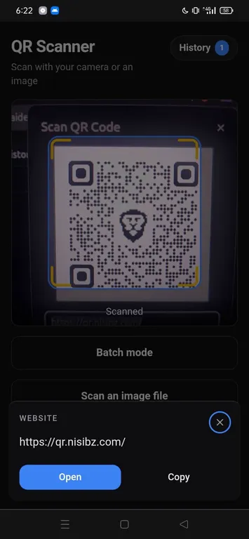
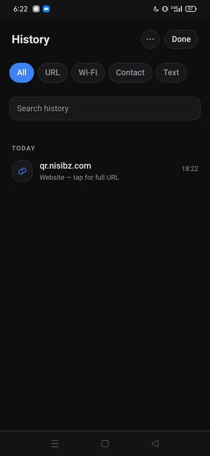

# QR Scanner — PWA

**Live: [qr.nisibz.com](https://qr.nisibz.com)** — install it from your mobile browser.

A fast, installable, offline-capable QR code scanner. Live camera scan + scan-from-image-file,
on-device history with meaningful titles for scanned URLs.

Built with **Bun + Vite + React + Tailwind + shadcn/ui**, deployed on **Cloudflare Workers**.

| Scan | History |
| --- | --- |
|  |  |

## Features
- 📷 Live camera scanning + 🖼️ scan from an image file
- 🧠 Smart result handling — URL / Wi-Fi / vCard / event / email / phone / SMS / location / crypto, with type-specific actions (open, call, compose, download `.vcf`/`.ics`, copy). Suspicious URLs trigger a safety warning.
- 📱 **Bottom-sheet results** — the decoded card slides up over the camera (docks inline on desktop)
- 📚 On-device history (IndexedDB, capped at 500 newest): titled rows (page `<title>` for URLs via the Worker's `/api/title` — YouTube handled through oEmbed), grouped by day, search + type chips, swipe-to-delete with confirmation
- 🔁 Export JSON / CSV · Import (merge, deduped) — device-to-device move without a server
- 📲 Installable PWA, works offline (service worker, cache versioned from `package.json`)
- 🌗 Dark, mobile-first UI

## Structure
```
web/                Vite + React app
  src/lib/          Domain logic: scanner wrapper, result parser, history store (TypeScript)
  src/components/   UI components + shadcn/ui primitives
  public/           PWA manifest + icons
  docs/             Screenshots
  tests/            Playwright E2E + QR fixtures
worker/             Cloudflare Worker: serves assets + /api/title endpoint
wrangler.toml       Workers config (assets = web/dist, main = worker/index.ts)
```

## Develop
```bash
cd web
bun install
bun run dev          # http://localhost:5173
bun run build        # type-check + production build to dist/
bun x playwright test
```

Camera requires a secure context — `localhost` counts.

## Deploy (Cloudflare Workers, Git integration)
- **Build command:** `cd web && bun install && bun run build`
- **Deploy command:** `npx wrangler deploy`
- **Custom domain:** `qr.nisibz.com` (Workers → Settings → Domains & Routes)

## Versioning
`web/package.json` `version` is the single source of truth. At build time,
Vite's `define` injects it as `__APP_VERSION__` into the service worker
(cache name) and the UI (History menu) — there is nothing else to bump.

SemVer: UI/bugfix changes → PATCH, features → MINOR, breaking → MAJOR.

## Notes
- History lives in IndexedDB on the device; nothing leaves the browser except
  scanned http(s) URLs, which are fetched server-side by `/api/title` to read
  the page title (private/loopback hosts are rejected).
- The `qr-scanner` engine is vendored at `web/vendor/`; replace the two files
  there to update it.
